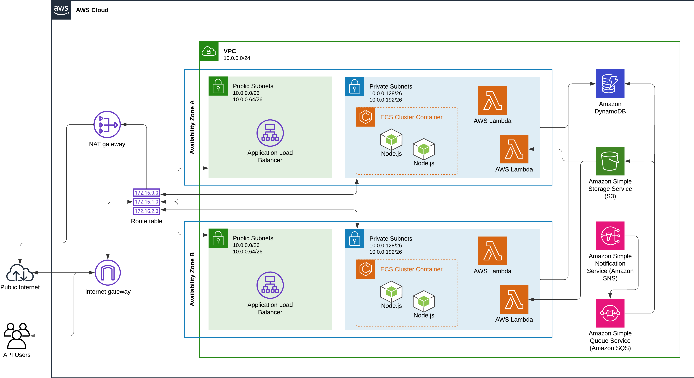
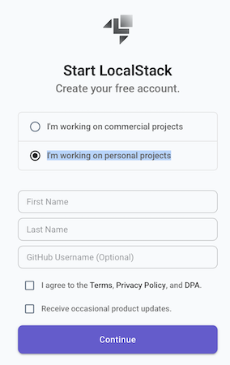
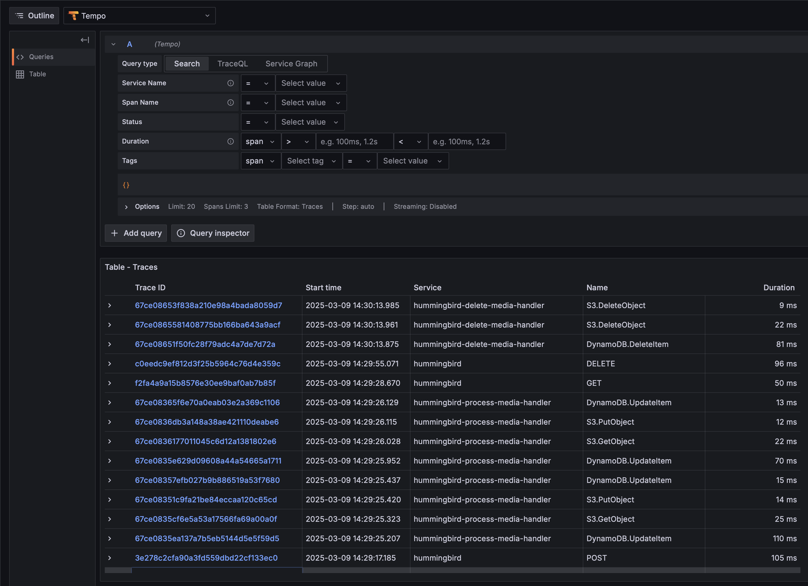

# cs7990-master-thesis

Monorepo for all code created during the development of Weder's Computer Sciences master thesis.

The Hummingbird app is an experiment created to explore the feasibility to implement a fairly complex distributed system
on local. The term "on local" (or locally) should be interpreted as "the act to develop software in one's personal
computer." Here the assumption is that the vast majority of software developers write software from their laptops or
desktops, deploying it somewhere else.

Commonly, "somewhere else" means deploying onto a cloud provider (Amazon Web Services, Google Cloud Platform, Oracle
Cloud, etc.). As the cloud is composed by several services, and most software systems uses a handful of cloud services,
running through an end-to-end workflow in the system requires redeploying the code after every iteration. Development
experience (DevX) is a challenge.

In contrast, before the advent of cloud computing, legacy on-premises systems had most, if not all or its components
deployed to the same computing engine (server). Reproducing this environment locally was somewhat straightforward. A
software developer using an IDE (Integrated Development Environment) was able to run through an end-to-end workflow,
inspecting all aspects of the application.

Local cloud emulation aims to provide practitioners the ability to mock several cloud services, in their local machines,
using an orchestrated fleet of Docker containers. [LocalStack](https://www.localstack.cloud) is the cloud emulator or
choice for this experiment.

Additionally, as every software system is a closed system, that is: one's ability to infer the state of a software
system is proportionally related to the systems capacity to emit useful telemetry. Telemetry is the broad definition for
all possible signals emitted from a system. Example of telemetry are: logs, traces, and metrics. Weder's research
interest lies in the intersection of software understandability, complexity management, and development experience.
Therefore, this experiment also implements [OpenTelemetry](https://opentelemetry.io/docs/) as the telemetry framework of
choice.

This experiment aims to validate the feasibility of implementing a fully functional system, powered by LocalStack
emulation, made observable with OpenTelemetry instrumentation.

# The Hummingbird App

This is a simple application, purposefully over-engineered. Several aspects of this application might not be considered
best practices if this system were to be deployed as a real software product.

## What Does It Do?

Hummingbird (Weder's favourite bird) is a simple media processing pipeline. The user can upload an image, get it
resized, and the download it. That's it!

## System Components

The application is composed by:

- Rest API: provides the endpoints to upload, inspect, download, resize, and delete a media file (for now, only images).
  The API is deployed over AWS ECS Fargate.
- Lambda functions to handle asynchronous workflows, such as resizing the uploaded images, or deleting existing images.
- Eventing services: AWS SNS and SQS are used to power the asynchronous workflows, serving as the pipeline of events
  emitted by Rest API.
- Storage: images are stored in AWS S3.
- Database: images' metadata is stored AWS DynamoDB.
- Networking components: several networking components are used, as to evaluate LocalStack compatibility with AWS
  networking systems. AWS VPCs, subnets, internet gateways, NAT gateways, Elastic IPs, and load balancers are used in
  the experiment.

# Humming Architecture Diagram



# Requirements

## Docker

This project utilizes Docker images to build resources, including Docker images for the ECS-powered app, and building an
AWS Lambda layer for the Javascript sharp module.

Ensure that Docker is installed before running the Terraform plan/apply commands.

Follow the [official instructions to get Docker installed.](https://docs.docker.com/engine/install/)

## LocalStack CLI

The quickest way get started with LocalStack is by using the LocalStack CLI. It allows you to start LocalStack from your
command line. Please make sure that you have a working Docker installation on your machine before moving on.

Follow the [official LocalStack docs](https://docs.localstack.cloud/getting-started/installation/) to install the CLI.

## awslocal CLI

The `awslocal` package provides a CLI, which is a thin wrapper around the aws command line interface for use with
LocalStack.

Follow the installation guide [here](https://github.com/localstack/awscli-local?tab=readme-ov-file#installation).

## Terraform

Follow the [official Terraform docs](https://developer.hashicorp.com/terraform/install).

Make sure to install the latest version, or any version above v1.10.5.

## tflocal (Terraform) wrapper

`tflocal` is a small wrapper script to run Terraform against LocalStack. `tflocal` script uses the Terraform Override
mechanism and creates a temporary file localstack_providers_override.tf to configure the endpoints for the AWS provider
section. The endpoints for all services are configured to point to the LocalStack API (http://localhost:4566 by
default). It allows you to easily deploy your unmodified Terraform scripts against LocalStack.

To install the tflocal command, you can use pip (assuming you have a local Python installation):

```shell
pip install terraform-local
```

## Make

For a better local development experience, this repository uses the [GNU Make tool](https://www.gnu.org/software/make).

If you're on Linux, it's likely that you already have `make` installed.
On MacOs, make sure you have Apple's Command Line Tools installed. It will install make for you.
For Windows, check [this blog post](https://leangaurav.medium.com/how-to-setup-install-gnu-make-on-windows-324480f1da69)
from leangaurav.

# Getting Started

## Configure Local Environment 

Run the command below to create the required environment/secret files, initialize the Terraform workspaces, and other needed
configurations.

Environment-specific files ignored by Git and won't be included in the repository.

```she
make configure
```

## LocalStack Pro

This project utilizes several AWS services which are only available with a LocalStack Pro subscription. At the time of
writing, it's possible to run LocalStack Pro with a Hobbyist subscription. **Make sure to select "I'm working on
personal projects" when signing up. (see image below)**



Before starting the application: obtain
an [auth token from LocalStack](https://docs.localstack.cloud/getting-started/auth-token/).

Substitute the temporary value `LOCALSTACK_AUTH_TOKEN` in the `.env` file. If the authentication is properly setup, it's
possible to access the LocalStack Pro AWS services. Also, when starting the application, the logs will display a message
similar to this one:

```
INFO --- [  MainThread] l.p.c.b.licensingv2        : Successfully activated cached license ...
```

## Grafana Cloud

**Note:** only applicable if deploying to AWS. Skip this step if deploying only to LocalStack.

This project uses Grafana as the observability backend. When deploying to AWS, telemetry will be forwarded to Grafana
Cloud using the OTLP connection.

Follow [this guide](https://grafana.com/docs/grafana-cloud/monitor-applications/application-observability/collector/opentelemetry-collector/)
to configure the OpenTelemetry Collector connection.

Replace both `grafana_cloud_api_key` and `grafana_cloud_instance_id` temporary values in `terraform/.secret.tfvars` with
the respective values obtained from the guide above.

## API Docs

The Hummingbird API documentation is available
at [hummingbird/docs/api/openapi.yml](./hummingbird/docs/api/openapi.yml). You can use
the [Swagger Editor](https://editor.swagger.io/) to visualize the API documentation.

## Running on Localhost

The project is configured to run locally by using a single command. The automation is provided by
the [Makefile](./Makefile).

To start the LocalStack CLI, deploy the infrastructure with Terraform and tail the logs, run:

```sh
make run-all-local
```

Once the deployment is done, you can access the API at: `http://hummingbird-alb.elb.localhost.localstack.cloud:4566`.
Check the API docs section for more information on available endpoints.

To stop the LocalStack CLI and remove the infrastructure, run:

```sh
make stop
```

Explore the `Makefile` for all other available commands.

## Visualizing OpenTelemetry Signals

This projects uses Grafana as the telemetry backend. For
localhost, [docker-otel-lgtm](https://github.com/grafana/docker-otel-lgtm) is utilized.

Once the application started, perform several requests to generate enough telemetry. Then, access http://localhost:3000
to visualize the telemetry in a locally hosted Grafana instance.


